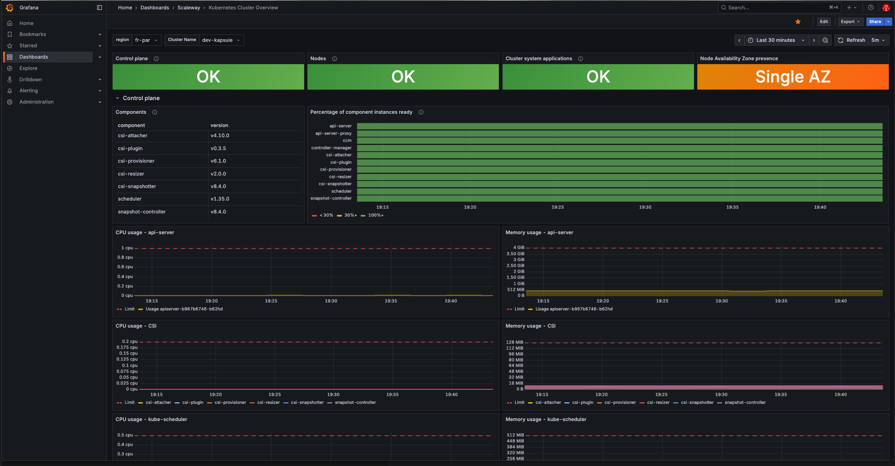

# Scaleway Starter Kit

An infrastructure starter kit for [Scaleway](https://www.scaleway.com/), built with **Terragrunt** and **OpenTofu**. A learning tool and starting point for deploying a secure, sovereign cloud platform on a European provider.

## Architecture

```
                Internet
                   │
              ┌────┴────┐
              │  Load   │  ← HTTPS (Let's Encrypt) — only public-facing resource
              │Balancer │
              └────┬────┘
                   │
     ┌─────────────┼─────────────┐
     │    VPC / Private Network  │
     │             │             │
     │   ┌─────────┴─────────┐   │
     │   │     Kapsule       │   │
     │   │   (Kubernetes)    │   │
     │   │  ┌─────────────┐  │   │
     │   │  │ Sovereign   │  │   │
     │   │  │ Cloud Wisdom│  │   │
     │   │  └──────┬──────┘  │   │
     │   └─────────┼─────────┘   │
     │             │             │
     │   ┌─────────┴─────────┐   │
     │   │    PostgreSQL     │   │
     │   │   (Managed DB)    │   │
     │   └───────────────────┘   │
     └───────────────────────────┘

     Secret Manager          Container Registry
     (DB credentials)        (Docker images)
```

### Components

| Component | Description | Security |
|-----------|-------------|----------|
| **VPC + Private Network** | Isolated network with a `172.16.0.0/22` subnet. All resources communicate over private IPs only. | Network isolation for all internal resources |
| **Kapsule** | Managed Kubernetes cluster with Cilium CNI, autoscaling (1–3 nodes), and autohealing. | Attached to private network, no public node exposure |
| **PostgreSQL** | Managed database (PostgreSQL 16) with automated backups (daily, 7-day retention). | Private network only — no public endpoint. Password managed via Secret Manager. |
| **Load Balancer** | Public load balancer with HTTPS (Let's Encrypt), HTTP→HTTPS redirect, and health checks. Connected to the private network. | TLS termination at the LB. The only externally reachable component. |
| **Secret Manager** | Stores database credentials securely. Synced to Kubernetes via External Secrets Operator. | Secrets never hardcoded, injected at runtime |
| **Container Registry** | Private Docker image registry hosted on Scaleway. | Images stored in France, private access only |
| **Cockpit** | Managed observability platform (Grafana, Mimir, Loki, Tempo). Kapsule metrics collected automatically. | Data stays in France, managed by Scaleway |

### Dependency Graph

```
vpc
 ├── kapsule → load-balancer
 └── database

secret-manager   (independent)
registry         (independent)
cockpit          (independent)
```

## Project Structure

```
infrastructure/
├── root.hcl                       # Shared Terragrunt config (S3 backend, provider)
├── modules/                       # Reusable Terraform modules
│   ├── vpc/                       # VPC + private network
│   ├── kapsule/                   # Kubernetes cluster + node pool
│   ├── database/                  # PostgreSQL managed database
│   ├── load-balancer/             # Public load balancer
│   ├── secret-manager/            # Scaleway Secret Manager
│   ├── registry/                  # Scaleway Container Registry
│   └── cockpit/                   # Scaleway Cockpit (observability)
└── dev/                           # Dev environment
    ├── env.hcl                    # Environment-specific variables
    ├── vpc/terragrunt.hcl
    ├── kapsule/terragrunt.hcl
    ├── database/terragrunt.hcl
    ├── load-balancer/terragrunt.hcl
    ├── secret-manager/terragrunt.hcl
    ├── registry/terragrunt.hcl
    └── cockpit/terragrunt.hcl

k8s/                               # Kubernetes manifests
├── namespace.yaml
├── external-secrets/              # External Secrets Operator config
│   └── external-secret.yaml
└── app/                           # Application deployment
    ├── deployment.yaml
    └── service.yaml

scripts/
├── validate.sh                    # Validation & security scanning
└── deploy.sh                      # Application deployment to Kapsule
```

The root Terragrunt config (`root.hcl`) is environment-agnostic — all environment-specific values live in `env.hcl`. To add a new environment (staging, prod), just create a new directory with its own `env.hcl`.

## Prerequisites

- [OpenTofu](https://opentofu.org/) >= 1.6.0
- [Terragrunt](https://terragrunt.gruntwork.io/) >= 0.93.0
- [kubectl](https://kubernetes.io/docs/tasks/tools/)
- [Helm](https://helm.sh/) (for External Secrets Operator)
- [jq](https://jqlang.github.io/jq/)
- A Scaleway account with API credentials

## Getting Started

### 1. Create the state bucket

In the [Scaleway console](https://console.scaleway.com/), create an Object Storage bucket:
- **Name:** `scaleway-starter-kit`
- **Region:** `fr-par`
- **Visibility:** Private

### 2. Create the `.env` file

```bash
cp .env.example .env
```

Edit `.env` with your Scaleway credentials and database password:

```bash
export SCW_ACCESS_KEY=<your-access-key>
export SCW_SECRET_KEY=<your-secret-key>
export SCW_DEFAULT_ORGANIZATION_ID=<your-org-id>
export SCW_DEFAULT_PROJECT_ID=<your-project-id>
export TF_VAR_db_password=<a-secure-password>
export KUBECONFIG="$(cd "$(dirname "${BASH_SOURCE[0]}")" && pwd)/infrastructure/dev/.kubeconfig"
```

Then load it:

```bash
source .env
```

### 3. (Optional) Custom domain with HTTPS

If you want HTTPS with a custom domain, register it in the [Scaleway Domains](https://console.scaleway.com/domains/) console and set `domain_name` in `infrastructure/dev/env.hcl`:

```hcl
domain_name = "yourdomain.eu"
```

The load balancer will automatically create a DNS A record, obtain a Let's Encrypt certificate, and redirect HTTP to HTTPS. If you skip this step, the load balancer works on plain HTTP.

> **Note:** On the first apply, the certificate creation may fail if DNS hasn't propagated yet. Simply re-run `terragrunt apply` in the load-balancer directory after a minute.

### 4. Deploy the infrastructure

```bash
cd infrastructure/dev
terragrunt run --all apply
```

Terragrunt will deploy in order: VPC → Kapsule + Database (parallel) → Load Balancer. Secret Manager and Container Registry are independent and deploy in parallel with the rest.

### 5. Generate the kubeconfig

After the Kapsule cluster is deployed:

```bash
cd infrastructure/dev/kapsule
terragrunt output -json kubeconfig | jq -r '.[0].config_file' > ../.kubeconfig
chmod 600 ../.kubeconfig
```

Then connect to the cluster:

```bash
kubectl get nodes
```

### 6. Deploy the application

The starter kit includes Kubernetes manifests for [**Sovereign Cloud Wisdom**](https://github.com/lejeunen/sovereign-cloud-wisdom), a demo application that serves curated wisdom about European digital sovereignty.

The app Docker image must be built and pushed to the Container Registry first (see the [app repository](https://github.com/lejeunen/sovereign-cloud-wisdom)).

**Run the deployment script:**

```bash
./scripts/deploy.sh
```

The script will:
1. Install [External Secrets Operator](https://external-secrets.io/) (if not already present)
2. Create Kubernetes secrets (registry pull credentials, Scaleway API access for ESO)
3. Create a `ClusterSecretStore` pointing to Scaleway Secret Manager
4. Sync the database password as a Kubernetes secret via `ExternalSecret`
5. Create the app `ConfigMap` with database connection details (fetched from Terragrunt outputs)
6. Deploy the application (Deployment + NodePort Service on port 30080)
7. Print the Kapsule node IPs for load balancer configuration

**Wire the load balancer:**

The script prints the node IPs at the end. Update `infrastructure/dev/load-balancer/terragrunt.hcl`:

```hcl
backend_server_ips = ["172.16.x.x"]
```

Then apply:

```bash
cd infrastructure/dev/load-balancer
terragrunt apply
```

**Verify:**

```bash
# Using the custom domain
curl https://sovereigncloudwisdom.eu/

# Or via IP (HTTP, will redirect to HTTPS if domain is configured)
LB_IP=$(cd infrastructure/dev/load-balancer && terragrunt output -raw lb_ip)
curl -L http://$LB_IP/
```

### 7. Access the Grafana dashboard

Cockpit is Scaleway's managed observability platform. Kapsule metrics are collected automatically at no cost, and is very easy to set up.

```bash
cd infrastructure/dev/cockpit
terragrunt output grafana_url
```

Open the Grafana URL and log in with your Scaleway IAM credentials. Pre-configured dashboards for Kapsule are available under the Scaleway folder.



## Adding a New Environment

1. Create a new environment directory:
   ```bash
   mkdir -p infrastructure/staging
   ```

2. Copy and adjust `env.hcl`:
   ```bash
   cp infrastructure/dev/env.hcl infrastructure/staging/env.hcl
   # Edit values (instance sizes, cluster name, etc.)
   ```

3. Copy the child module configs (they're identical — all values come from `env.hcl`):
   ```bash
   for module in vpc kapsule database load-balancer secret-manager registry cockpit; do
     mkdir -p "infrastructure/staging/$module"
     cp "infrastructure/dev/$module/terragrunt.hcl" "infrastructure/staging/$module/"
   done
   ```

4. Deploy:
   ```bash
   cd infrastructure/staging
   terragrunt run --all apply
   ```

## Validation & Security Scanning

A validation script checks formatting, configuration, dependencies, linting, and security:

```bash
source .env
./scripts/validate.sh
```

The script runs the following checks:

| Check | Tool | Description |
|-------|------|-------------|
| HCL format | `terragrunt hcl fmt` | Ensures consistent formatting |
| Terraform validation | `terragrunt validate` | Validates resource configurations |
| Dependency graph | `terragrunt dag graph` | Detects circular dependencies |
| Linting | `tflint` | Catches common Terraform mistakes |
| Security scan | `trivy` | Flags security misconfigurations (HIGH/CRITICAL) |

Optional tools (`tflint`, `trivy`) are skipped if not installed:

```bash
brew install tflint trivy
```

To validate a different environment:

```bash
./scripts/validate.sh infrastructure/staging
```

## Compliance & Sovereignty

This project is designed with European data sovereignty in mind. All resources are deployed exclusively in France (`fr-par`), using Scaleway — a French cloud provider not subject to US extraterritorial surveillance laws (CLOUD Act, FISA Section 702).

For a non-technical overview of why sovereign cloud matters, see:
- [WHY-SOVEREIGN-CLOUD.md](WHY-SOVEREIGN-CLOUD.md) (English)
- [WHY-SOVEREIGN-CLOUD.fr.md](WHY-SOVEREIGN-CLOUD.fr.md) (French)

For details on how this project addresses GDPR, SecNumCloud, NIS2, and DORA requirements, see:
- [COMPLIANCE.md](COMPLIANCE.md) (English)
- [COMPLIANCE.fr.md](COMPLIANCE.fr.md) (French)

## What's Not Included

This starter kit is a foundation, not a turnkey production setup. You would still need to add:

- **GitOps** workflow (ArgoCD, Flux)
- **CI/CD** pipeline for infrastructure and application
- **Ingress controller** for path-based routing
- **Network policies** for fine-grained pod-to-pod traffic control
- **Secure private network access** (VPN or bastion) for reaching internal resources like the database
- **Backup strategy** beyond the managed database backups
- And more, depending on your specific requirements

## Tear Down

```bash
cd infrastructure/dev
terragrunt run --all destroy
```
